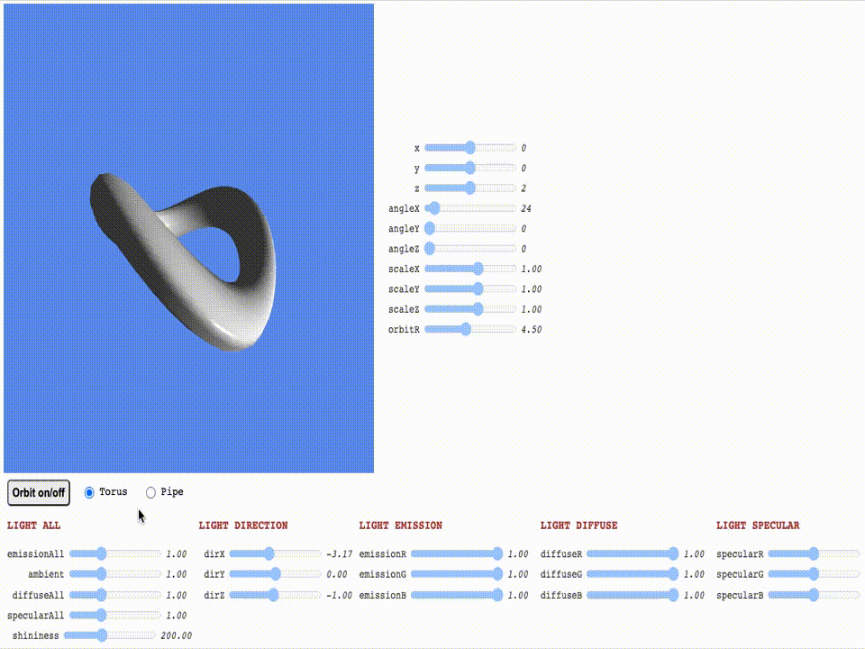

# GPU-generated Keyframe Animation

A WebGL program for displaying GPU-generated animations through interpolation of vertex positions between the predefined keyframes of a 3D object. Demo can be found [here](http://www.student.dtu.dk/~s192771/webgl-keyframe-animation/).

## Description

This program was created in the scope of a project for the Computer Graphics course at the Technical University of Denmark. It can load keyframes of a 3D object and interpolate positions of the vertices between the frames on the GPU and display the resulting animation. The model can be additionally scaled, translated, rotated and lighting effects can be applied. An in-depth description of the project, methods and results can be found [here](https://www.student.dtu.dk/~s192771/KeyframeAnimation.pdf).

## Getting Started

### Dependencies

- [WebGL-supported](https://get.webgl.org/) web browser

### Installing

- Clone or download this repository

### Executing program

- Open index.html

## Further work

- Add texture support
- Add interface for loading object keyframes
- Add keyboard controls for moving around the scene
- Add multiple objects at the same time

## Authors

- Mateusz Sadowski
[linkedin.com/in/mateuszsadowski1/](https://www.linkedin.com/in/mateuszsadowski1/)
[mateusz.sadowski1@gmail.com](mateusz.sadowski1@gmail.com)
- Priya Sapra
- Branavan Annalingam

## License

This project is licensed under the MIT License - see the LICENSE.md file for details.

## Acknowledgments

* [README-Template](https://gist.github.com/DomPizzie/7a5ff55ffa9081f2de27c315f5018afc)